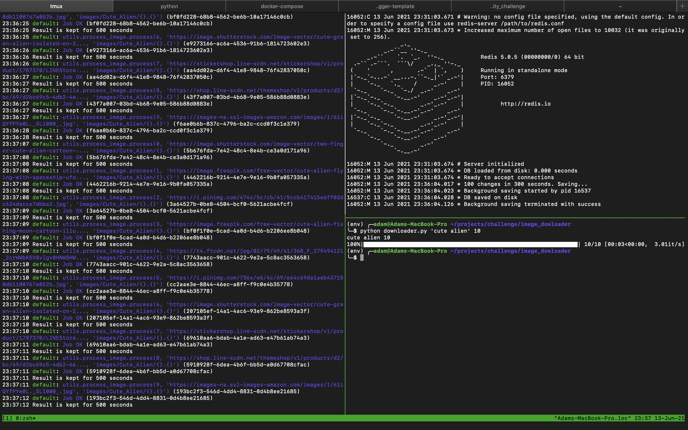

## Google image downloader

## requirements

- Python.3.6
- Redis
- Selenium webdriver
- rq

## Installation

1. Create a virtulaenv 
2. Activate it
3. Install requirements
    > pip install -r requirements.txt
4. Download the chrome driver from this [link](https://chromedriver.chromium.org/downloads)

## Usage

1. Run your redis server in one terminal:
> redis-server

2. start the rq workers in a separate terminal  
>rq worker 

3. Run the downloader
> downloader.py 'cute alpaca' 10

Demo 

Todo
- [x] Async worker
- [ ] Clean the code
- [ ] Dockerize

